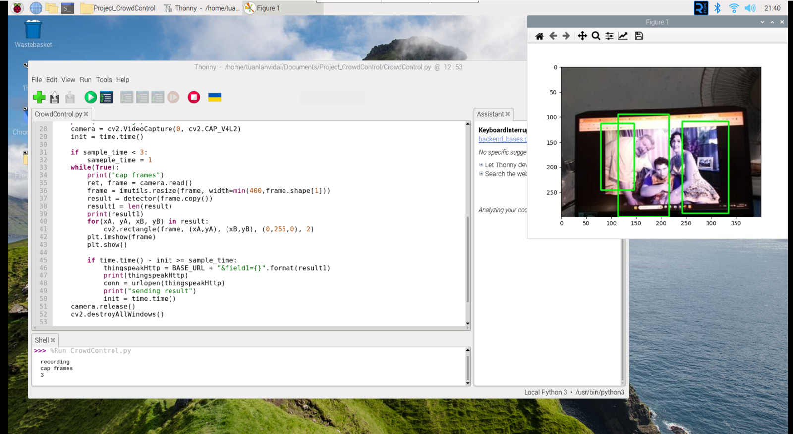
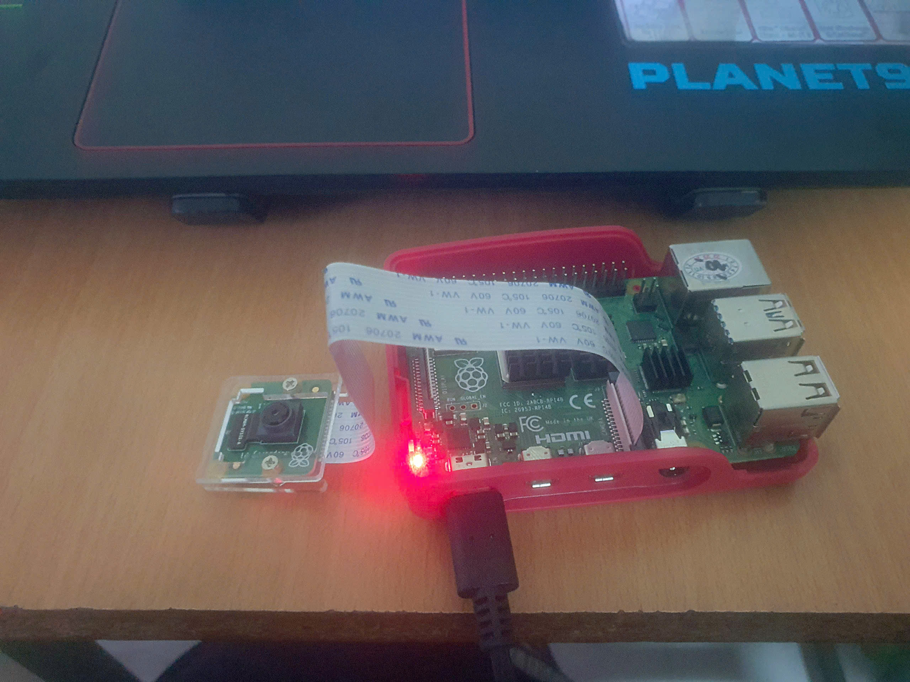

# PiVisionCounter

**PiVisionCounter** is a real-time crowd counting system using OpenCV on a Raspberry Pi. It captures frames from a Pi Camera, processes them using Histogram of Oriented Gradients (HOG) descriptors, and counts the number of people in the frame. The results are transmitted to the ThingSpeak IoT platform for remote monitoring.

## Table of Contents
- [Components](#components)
- [Installation](#installation)
- [Usage](#usage)
  - [Using the Command Line](#using-the-command-line)
  - [Using Thonny IDE](#using-thonny-ide)
- [Sample Output](#sample-output)
- [Hardware Setup](#hardware-setup)
- [License](#license)
- [Contact](#contact)

## Components

### Hardware:
- Raspberry Pi 4 Model B (or compatible version)
- Raspberry Pi Camera Module V2
- Power Supply for Raspberry Pi
- MicroSD Card with Raspbian OS installed
- Internet connection (Ethernet or Wi-Fi)

### Software & Online Services:
- Python 3.0
- OpenCV 3.0 Library
- ThingSpeak IoT Platform

## Installation

### 1. Clone the repository:
```bash
git clone https://github.com/tuanlanvidai/PiVisionCounter.git
```

### 2. Install required dependencies:
Run the provided shell script to install all necessary dependencies on your Raspberry Pi:
```bash
bash scripts/install_dependencies.sh
```

Or, you can manually install the dependencies by following these commands:
```bash
sudo apt-get update
sudo apt-get install -y libhdf5-dev libhdf5-serial-dev libatlas-base-dev libjasper-dev libqtgui4 libqt4-test
pip3 install opencv-contrib-python imutils matplotlib
```

### 3. Configure ThingSpeak:
1. Create an account on ThingSpeak and set up a new channel with a field for "People Counting."
2. Copy the API key and Channel ID, and update the `src/crowd_count.py` script with these values.

```python
channel_id = 'YOUR_CHANNEL_ID'
WRITE_API = 'YOUR_API_KEY'
```

## Usage

### Using the Command Line
1. Navigate to the `src/` directory:
    ```bash
    cd PiVisionCounter/src
    ```

2. Run the Python script:
    ```bash
    python3 crowd_count.py
    ```

3. The program will automatically capture frames and send crowd count data to your ThingSpeak channel.

### Using Thonny IDE
1. Open Thonny IDE on your Raspberry Pi.
2. Open the `crowd_count.py` file from the `src/` directory.
3. Click the **Run** button (or press `F5`) to execute the script.
4. The program will start counting and display results on your ThingSpeak channel.

## Sample Output

### Result Screen:
The system will capture people in real-time and display the results as shown below:


### Hardware Setup:
Ensure your Raspberry Pi and camera are set up as shown in the photo below:


## Hardware Setup

1. Connect the **Raspberry Pi Camera Module** to the Raspberry Pi using the ribbon cable.
2. Set up the Raspberry Pi and ensure it has internet access for ThingSpeak communication.
3. Test the camera by using:
    ```bash
    raspistill -v -o test.jpg
    ```
4. Follow the instructions provided in the full **Project Report** (`docs/Project_Report.pdf`) for more details on setting up the hardware and software.

## License

This project is licensed under the MIT License - see the [LICENSE](LICENSE) file for details.

## Contact

For any inquiries or issues with this project, feel free to contact:
- **Your Name**: lantruongtuan333@gmail.com
- GitHub: [tuanlanvidai](https://github.com/tuanlanvidai)
